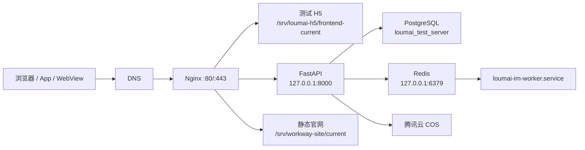

# 工位有方测试服务器运维学习手册

更新日期：2026-08-14

适用服务器：`132.232.220.115`

适用对象：需要独立完成测试服检查、发布、配置修改、日志排查和安全清理的开发人员。

本文不会记录密码、Token、私钥或数据库口令。命令中的 `<...>` 是占位符，执行前必须替换。

> 这不是“复制整页命令一次运行”的脚本。先确认命令标注的执行位置，再按小节逐步执行和检查输出。

## 1. 先学会运维的基本方法

运维不是“看到报错就重启”，而是固定遵循以下闭环：

```text
观察现状 → 判断影响范围 → 备份恢复点 → 只改一个目标 → 验证结果 → 记录变更
```

### 1.1 三类命令标记

本文使用三种标记：

| 标记 | 含义 | 是否会改变服务器 |
|---|---|---|
| `[只读]` | 查看状态、日志、版本、配置 | 不会 |
| `[变更]` | 发布、重启、修改配置、切换版本 | 会 |
| `[高危]` | 删除、恢复数据库、降级、批量改数据 | 可能造成停机或数据丢失 |

遇到问题时，先执行 `[只读]` 命令。证据不足时不要直接进入 `[变更]` 或 `[高危]`。

### 1.2 分清“本机”和“服务器”

本机通常看到这样的提示符：

```text
➜  deploy--loumai git:(master)
```

服务器通常看到：

```text
ubuntu@VM-0-4-ubuntu:~$
```

本文代码块会写明执行位置。不要复制提示符、命令输出或 Markdown 的 ``` 符号。

### 1.3 不要滥用 `set -e`

`set -e` 会让一组命令在首个错误处退出，适合已经验证过的脚本，不适合边排查边粘贴。

学习阶段建议：

1. 一次执行一个小节。
2. 看清输出后再继续。
3. 不要把上一次终端输出和下一条命令粘在同一行。
4. 失败后先定位失败步骤，不要直接从中间重复执行带删除或切换的命令。

## 2. 当前服务器真实状态快照

以下状态来自 2026-08-14 实机只读检查。以后以实时命令输出为准。

| 项目 | 当前状态 |
|---|---|
| 主机名 | `VM-0-4-ubuntu` |
| Nginx | `active` |
| FastAPI | `loumai-api.service=active` |
| 腾讯 IM Worker | `loumai-im-worker.service=active` |
| PostgreSQL | `postgresql@18-main.service=active` |
| Redis | `redis-server.service=active` |
| 后端当前版本 | `20260812T015409Z-57ff9551cf` |
| 后端 Git Commit | `57ff9551cf7e30e5ddd838608fc4fc7254a108fd` |
| 数据库版本 | `20260811_0074` |
| H5 当前版本 | `20260812T071432Z-26c7963373` |
| 官网当前版本 | `20260811-icp-2026032754` |
| API 健康检查 | `status=ok, database=ok` |
| 根磁盘 | 49GB，总使用约 22%，剩余约 37GB |
| 旧 Node 服务 | 已删除，5000 端口已关闭 |
| `/home/ubuntu` 顶层旧包 | 已清理，当前只显示正常的 `snap` |

重要提醒：这份快照只说明服务器当前运行的是 `57ff9551cf / 0074`，不能证明本地最新地图代码已经发布。判断“最新代码是否上线”，必须同时比较本地 Commit、服务器 release metadata 和数据库 revision。

## 3. 一张图理解整个测试服



### 3.1 五类内容不能混在一起

| 类型 | 作用 | 正确位置 | Git 是否管理 |
|---|---|---|---|
| 源代码 | 开发和构建输入 | 本地 Git 仓库 | 是 |
| 发布产物 | 服务器实际运行的确定版本 | `/srv/.../releases` | 发布器间接管理 |
| 运行配置 | 数据库地址、功能开关、密钥 | `/etc/loumai/*.env` | 否 |
| 业务数据 | PostgreSQL、Redis、COS、兼容上传目录 | 数据库/COS/共享目录 | 否 |
| 基础设施 | Nginx、systemd、证书 | `/etc/nginx`、`/etc/systemd`、`/etc/letsencrypt` | 否 |

### 3.2 最重要的边界

1. 不在服务器 release 目录里直接改 Python 或前端文件。
2. 不把本地 `.env` 上传覆盖测试服配置。
3. 不把 `/srv` 中看起来旧的目录直接删除。
4. 不手工执行 Alembic downgrade。
5. 不把 Redis、PostgreSQL、8000 端口暴露到公网。
6. 每次只改变一个目标，并准备恢复方法。

## 4. 域名和请求流向

### 4.1 测试 H5 与 API

```text
test.yinlizhangyu.com
  └─ Nginx
     ├─ /              → /srv/loumai-h5/frontend-current
     ├─ /api/*         → 127.0.0.1:8000
     ├─ /uploads/*     → 127.0.0.1:8000
     ├─ /health        → FastAPI 健康检查
     └─ 验证 TXT       → 独立持久化验证目录
```

### 4.2 后端与 IM Worker

```text
loumai-api.service
  → /srv/loumai-backend/backend-current
  → /srv/loumai-backend/backend-releases/<RELEASE_ID>/backend
  → 127.0.0.1:8000

loumai-im-worker.service
  → 同一个 backend-current
  → 消费 Redis 中的腾讯 IM 回调任务
```

### 4.3 工位有方静态官网

```text
yinlizhangyu.com / www.yinlizhangyu.com
  → Nginx
  → /srv/workway-site/current
  → /srv/workway-site/releases/<RELEASE_ID>
```

### 4.4 `loumaiai.com`

`loumaiai.com` 当前由另一台服务器 `47.109.177.185` 承担，不要在本测试服务器重新创建旧的 `loumai.service`、5000 端口或对应 Nginx 站点。

## 5. 目录职责和清理边界

### 5.1 必须保留

| 路径 | 作用 |
|---|---|
| `/srv/loumai-backend` | 当前 API 与 IM Worker 的受控发布根目录 |
| `/srv/loumai-h5` | 测试 H5 发布根目录 |
| `/srv/workway-site` | 静态官网发布根目录 |
| `/etc/loumai/backend.env` | API 与 IM Worker 的真实业务配置 |
| `/etc/loumai/sms.env` | 短信相关真实配置 |
| `/etc/loumai/backend-release.env` | 后端发布器配置 |
| `/etc/loumai/h5-release.env` | H5 发布器配置 |
| `/var/backups/loumai` | 数据库发布前备份和哈希 |
| `/srv/loumai/shared/uploads` | 历史本地上传兼容目录，仍可能被配置引用 |
| `/etc/nginx` | Nginx 站点配置 |
| `/etc/letsencrypt` | HTTPS 证书及续期配置 |

### 5.2 `/home/ubuntu` 为什么还有隐藏目录

当前执行 `ls` 只看到 `snap`，说明早期手工上传包已经清理。图形文件管理器还会显示：

```text
.cache .config .local .npm .pip .ssh .profile .bashrc ...
```

这些是 Linux 用户的正常配置、缓存和 SSH 目录，不等于“服务器垃圾”。特别是 `.ssh` 不可删除。

查看空间，而不是凭名字判断：

```bash
# [只读] 服务器执行
du -xhd1 /home/ubuntu 2>/dev/null | sort -h
```

### 5.3 已完成的清理

- 旧 Node 官网 service、目录、Nginx 入口和 5000 端口已清理。
- `/home/ubuntu` 顶层早期 ZIP、tar、脚本、截图和旧 secrets 文件已隔离验证后永久删除。
- `/srv/loumai-backend/backend-releases` 中失败的 133MB `.partial` 已删除。
- 清理后 API、IM Worker、Redis、PostgreSQL、Nginx 和公网健康检查均通过。

### 5.4 仍存在但不能直接删除的候选

| 路径 | 当前情况 | 处理原则 |
|---|---|---|
| `/srv/loumai-backend/incoming/20260811T101111Z-57ff9551cf.partial` | 约 4.1MB 失败上传残留 | 再次确认无发布进程、当前版本不引用后再隔离 |
| `/tmp/workway-site-*.tar.gz` | 两个早期官网上传包 | 确认官网 release 和回滚点完整后再清理 |
| `/srv/loumai` | 旧发布体系和共享上传混合目录 | 绝不能整体删除，需逐项迁移和核对引用 |
| `/var/backups/loumai/*.dump` | 数据库恢复点 | 保留，不属于垃圾文件 |

禁止执行：

```bash
rm -rf /srv/loumai
rm -rf /srv/loumai-backend
rm -rf /etc/loumai
rm -rf /var/backups/loumai
```

## 6. 每天开始工作的 3 分钟检查

### 6.1 登录服务器

在本机执行：

```bash
export LOUMAI_TEST_HOST=ubuntu@132.232.220.115
export LOUMAI_TEST_KEY="$HOME/.ssh/loumai_test_hexhub"

ssh -i "$LOUMAI_TEST_KEY" "$LOUMAI_TEST_HOST"
```

### 6.2 一次查看核心健康状态

在服务器执行：

```bash
# [只读]
date
hostname
uptime
df -h /
free -h

systemctl --failed --no-pager
for unit in \
  nginx \
  loumai-api.service \
  loumai-im-worker.service \
  postgresql@18-main.service \
  redis-server.service
do
  printf '%-36s' "$unit"
  systemctl is-active "$unit"
done

curl -fsS http://127.0.0.1:8000/health
echo
redis-cli -u redis://127.0.0.1:6379/0 ping
```

正常结果：

- `systemctl --failed` 没有失败单元。
- 五个服务均为 `active`。
- API 返回 `status=ok, database=ok`。
- Redis 返回 `PONG`。
- 磁盘和内存没有接近耗尽。

### 6.3 查看当前版本

```bash
# [只读] 服务器执行
readlink -f /srv/loumai-backend/backend-current
readlink -f /srv/loumai-h5/frontend-current
readlink -f /srv/workway-site/current

sudo -n /usr/local/sbin/loumai-backend-release status active
```

`current` 是软链接。发布器通过原子切换软链接上线，不是覆盖正在运行的目录。

## 7. 标准发布操作

## 7.1 发布后端

执行位置：本机 `/Users/qinyang/Desktop/zuling/deploy--loumai`。

发布前先确认业务仓库：

```bash
# [只读] 本机执行
cd /Users/qinyang/Desktop/zuling/loumai-ai
git status --short --branch
git log -1 --oneline
git rev-list --left-right --count HEAD...@{upstream}
```

必须满足：

1. 没有未提交文件。
2. 当前分支为 `test`，且测试服发布配置的 `BACKEND_EXPECTED_BRANCH=test`。
3. Commit 已推送，上下游差异为 `0 0`。
4. Alembic 只有一个 head。
5. 代码测试通过。

然后执行：

```bash
# [只读预演 + 变更] 本机执行
cd /Users/qinyang/Desktop/zuling/deploy--loumai

./loumai-deploy backend deploy --dry-run
./loumai-deploy backend deploy --yes
./loumai-deploy backend status
```

为什么一条 `deploy --yes` 能完成发布：

```text
本地检查 Git/测试/迁移
  → 从确定 Commit 构建归档
  → 上传并校验 SHA256
  → 服务器创建隔离 venv
  → 停止明确的写入服务
  → 备份数据库
  → 执行正向迁移
  → 原子切换 backend-current
  → 启动 API 和 IM Worker
  → 本机及公网健康检查
```

发布过程中不要关闭本机终端。若连接中断，先检查进程和线上健康，不要立刻重复发布：

```bash
# [只读] 服务器执行
ps -ef | grep -E '[l]oumai-backend-release|[u]v (venv|pip)' || true
readlink -f /srv/loumai-backend/backend-current
systemctl is-active loumai-api.service
curl -fsS http://127.0.0.1:8000/health
```

### 7.1.1 发布后端后的验收

```bash
# [只读] 服务器执行
sudo -n /usr/local/sbin/loumai-backend-release status active

API_PID=$(systemctl show loumai-api.service -p MainPID --value)
WORKER_PID=$(systemctl show loumai-im-worker.service -p MainPID --value)

sudo readlink -f "/proc/$API_PID/cwd"
sudo readlink -f "/proc/$WORKER_PID/cwd"

curl -fsS http://127.0.0.1:8000/health
curl -fsS https://test.yinlizhangyu.com/health
```

API 和 Worker 的实际工作目录必须落到同一个新 release。

## 7.2 发布测试 H5

执行位置：本机部署工具仓库。

```bash
# [只读预演 + 变更] 本机执行
cd /Users/qinyang/Desktop/zuling/deploy--loumai

./loumai-deploy frontend deploy --env test --dry-run
./loumai-deploy frontend deploy --env test --yes
./loumai-deploy frontend status
```

发布后至少验收：

1. 登录页能打开。
2. API 指向 `https://test.yinlizhangyu.com/api/v1`。
3. 登录、工作台、图片、地图页面没有旧缓存错误。
4. 浏览器 Network 中入口 JS 是新哈希。

不要长期依赖别人发来的原始 `web.zip`。标准发布必须从确定 Git Commit 重新构建，这样才能检查 API 地址、浏览器兼容代码和产物哈希。

## 7.3 发布静态官网

```bash
# [变更] 本机执行
cd /Users/qinyang/Desktop/zuling/deploy--loumai

./loumai-deploy website deploy --yes
./loumai-deploy website status
```

首次接管新域名才需要分阶段执行 `prepare` 和 `enable-https`；当前域名已部署并签发证书，日常更新不应重复申请证书。

## 8. 环境变量：为什么不随代码一起上传

代码和配置故意分离：

- Git/release 负责“程序支持哪些变量”。
- `/etc/loumai/backend.env` 负责“测试服使用什么值”。
- `/etc/loumai/sms.env` 负责短信敏感配置。

因此，后端一键发布不会上传本地 `.env`。这是安全设计，不是漏功能。

### 8.1 新增配置的正确顺序

1. 先在 Python `Settings` 中实现变量，并更新 `.env.example` 空值说明。
2. 提交、推送代码。
3. 在测试服备份并修改真实 env。
4. 发布代码或重启对应服务。
5. 用不泄密的方式验证变量已读取。

### 8.2 修改真实后端配置

```bash
# [变更] 服务器执行
STAMP=$(date +%Y%m%d-%H%M%S)

sudo cp -a /etc/loumai/backend.env \
  "/etc/loumai/backend.env.before-change-$STAMP"

sudoedit /etc/loumai/backend.env
```

编辑完成后，先检查配置能否被 Python 解析。不要输出配置值：

```bash
# [只读] 服务器执行
cd /srv/loumai-backend/backend-current

sudo -u ubuntu \
  /srv/loumai-backend/backend-current/.venv/bin/python -c \
  'from app.core.config import get_settings; get_settings(); print("配置解析通过")'
```

然后重启受影响的服务：

```bash
# [变更] 服务器执行
sudo systemctl restart loumai-api.service loumai-im-worker.service

for i in $(seq 1 30); do
  if curl -fsS http://127.0.0.1:8000/health; then
    echo
    echo "后端启动成功"
    break
  fi
  sleep 1
done
```

这段命令会等待最多 30 秒，避免 systemd 已启动进程但 Uvicorn 尚未监听时产生误报。若没有看到“后端启动成功”，立即查看 API 与 IM Worker 日志，不要连续重复重启。

如果失败，立即查看日志；确认是新配置导致时恢复备份：

```bash
# [变更] 把路径替换成刚才的实际备份文件
sudo cp -a \
  /etc/loumai/backend.env.before-change-<TIMESTAMP> \
  /etc/loumai/backend.env

sudo systemctl restart loumai-api.service
sudo systemctl restart loumai-im-worker.service
```

### 8.3 列出变量名但不泄露值

```bash
# [只读] 服务器执行
sudo awk -F= '
  /^[[:space:]]*#/ || /^[[:space:]]*$/ { next }
  /^[A-Za-z_][A-Za-z0-9_]*=/ { print $1 "=已配置" }
' /etc/loumai/backend.env
```

不要执行 `sudo cat /etc/loumai/backend.env` 后把输出发到聊天或截图中。

### 8.4 自动比较本地与测试服 env

在本机执行下面的只读命令。默认只显示阻断项、警告和需要确认的环境差异：

```bash
cd /Users/qinyang/Desktop/zuling/deploy--loumai \
  && ./loumai-deploy backend env-audit --env test
```

查看全部变量名及两边状态：

```bash
cd /Users/qinyang/Desktop/zuling/deploy--loumai \
  && ./loumai-deploy backend env-audit --env test --all
```

报告中的每个差异包含四部分：

- 本地：`loumai-ai/.env` 是缺失、空值、非空，或者安全白名单内的公开配置值；
- 测试服：合并读取 `/etc/loumai/backend.env` 与 `/etc/loumai/sms.env` 后的对应状态；
- 原因：该差异为什么可能造成启动失败或功能行为不一致；
- 建议：应保留环境差异，还是需要在测试服单独补充配置。

密码、JWT、短信、COS、数据库、Redis、微信、天地图及视频媒体票据等敏感值始终隐藏。审计不会用哈希比较密钥，也不会把本地 `.env` 上传到服务器。

以下情况属于阻断：

- env 文件格式错误、非受控重复定义或服务器文件权限不安全；仅允许当前活动数据库 profile 按最后加载顺序各覆盖一次基础文件中的 `DATABASE_URL`、`MIGRATION_DATABASE_URL`；
- 测试服 `APP_ENVIRONMENT` 不是 `test`；
- `APP_ENVIRONMENT`、`DATABASE_URL`、`JWT_SECRET_KEY` 缺失或为空；
- 本地或测试服当前版本的 `Settings` 无法初始化；
- 服务器 helper 太旧或审计协议不匹配。

普通的“本地有、测试服没有”和非敏感开关值不同会详细显示为警告，避免把合理的开发/测试环境差异误当成密钥错误。该命令完全只读，不修改服务器 env，也不重启服务。

如果提示服务器 helper 太旧或指纹不一致，优先使用受控同步命令：

```bash
cd /Users/qinyang/Desktop/zuling/deploy--loumai
./loumai-deploy backend sync-helper --env test --yes
```

本机 `config/backend.test.local.env` 必须先显式设置：

```dotenv
BACKEND_TEST_HELPER_SYNC_ENABLED=true
```

该命令要求部署工具代码已提交并推送，自动执行测试、随机临时上传、SHA256 校验、发布锁、root 私有备份、候选 preflight、同文件系统原子切换和失败恢复。它不会修改业务 env、切换后端版本、迁移数据库或重启服务。同步完成后重新执行 `env-audit`。正式服禁止使用此命令。

## 9. 服务管理与日志

### 9.1 查看 service 实际配置

```bash
# [只读]
sudo systemctl cat loumai-api.service
sudo systemctl cat loumai-im-worker.service

sudo systemctl show loumai-api.service \
  -p User -p Group -p WorkingDirectory -p ExecStart -p MainPID \
  --no-pager
```

当前 API 基础 unit 还有 drop-in 覆盖，最终配置以 `systemctl cat/show` 为准，不能只看 `/etc/systemd/system/loumai-api.service` 单个文件。

### 9.2 查看日志

```bash
# [只读]
sudo journalctl -u loumai-api.service -n 100 --no-pager
sudo journalctl -u loumai-im-worker.service -n 100 --no-pager
sudo journalctl -u nginx -n 100 --no-pager
sudo tail -n 100 /var/log/nginx/error.log
```

实时追踪，按 `Ctrl+C` 退出：

```bash
sudo journalctl -u loumai-api.service -f
```

查看指定时间范围：

```bash
sudo journalctl -u loumai-api.service \
  --since "2026-08-14 09:00:00" \
  --until "2026-08-14 10:00:00" \
  --no-pager
```

### 9.3 什么时候可以重启

可以重启：明确修改了 env、systemd 配置或进程异常退出循环。

不要盲目重启：数据库迁移执行中、发布进程仍在运行、错误原因未知。

## 10. Redis 与腾讯 IM Worker

### 10.1 基础检查

```bash
# [只读]
systemctl is-active redis-server.service
systemctl is-active loumai-im-worker.service
redis-cli -u redis://127.0.0.1:6379/0 ping
```

### 10.2 查看 IM 队列长度

```bash
# [只读]
for key in \
  loumai:im:callbacks \
  loumai:im:callbacks:processing \
  loumai:im:callbacks:failed
do
  printf '%s=' "$key"
  redis-cli -u redis://127.0.0.1:6379/0 LLEN "$key"
done
```

判断方法：

- `callbacks` 短暂增加后下降：通常正常。
- `processing` 长时间不下降：Worker 可能卡住。
- `failed` 持续增加：先看 Worker 日志和回调数据，不要直接删除队列。

禁止在不了解影响时执行 `FLUSHALL`、`FLUSHDB` 或 `DEL` 业务队列。

## 11. PostgreSQL 与备份

### 11.1 为什么图形工具显示多个数据库

| 数据库 | 用途 | 是否可删 |
|---|---|---|
| `loumai_test_server` | 测试业务数据库 | 不可删除 |
| `postgres` | PostgreSQL 默认管理库 | 不可删除 |
| `template1` | 创建数据库使用的系统模板 | 不可删除 |

只读查看：

```bash
# [只读] 服务器执行
sudo -u postgres psql -X -At -F '|' -c \
  "SELECT datname, pg_size_pretty(pg_database_size(datname))
   FROM pg_database
   WHERE datallowconn
   ORDER BY datname;"
```

### 11.2 查看 Alembic 版本

```bash
# [只读]
sudo -u postgres psql -X -At -d loumai_test_server \
  -c 'SELECT version_num FROM alembic_version;'
```

### 11.3 查看发布备份

```bash
# [只读]
sudo find /var/backups/loumai \
  -maxdepth 1 -type f \
  -printf '%TY-%Tm-%Td %TH:%TM %10s %f\n' \
  | sort
```

检查某个 dump 是否可读：

```bash
# [只读] 替换实际文件名
sudo -u postgres pg_restore --list \
  /var/backups/loumai/<BACKUP_FILE>.dump \
  >/dev/null \
  && echo "备份目录可读取"
```

### 11.4 数据库红线

- 发布器只做正向迁移，不自动 downgrade。
- 数据迁移后应用回滚不一定安全。
- 恢复 dump 会覆盖发布后产生的数据，不能自行尝试。
- 不执行 `DROP DATABASE`、`DROP TABLE`、`TRUNCATE` 或来源不明的 SQL。
- 迁移失败时保存现场、日志、当前 release 和 DB revision，优先前向修复。

## 12. Nginx、域名与 HTTPS

### 12.1 查看真正生效的配置

```bash
# [只读]
ls -l /etc/nginx/sites-enabled
sudo nginx -t

sudo nginx -T 2>/dev/null | \
  grep -E 'server_name|root |proxy_pass |ssl_certificate '
```

当前启用站点包括：

- `default`
- `loumai-test`
- `workway-official`

最终以 `nginx -T` 为准，不以 `sites-available` 里有多少历史文件为准。

### 12.2 安全修改 Nginx

```bash
# [变更] 示例：修改测试站
STAMP=$(date +%Y%m%d-%H%M%S)

sudo cp -a /etc/nginx/sites-available/loumai-test \
  "/etc/nginx/sites-available/loumai-test.before-$STAMP"

sudoedit /etc/nginx/sites-available/loumai-test

sudo nginx -t
sudo systemctl reload nginx
systemctl is-active nginx
```

规则：`nginx -t` 未通过时绝不 reload。日常配置更新使用 `reload`，不要无原因 `restart`。

#### 测试 H5 的 Referrer-Policy

`test.yinlizhangyu.com` 同时承载浏览器 H5 和 `/api`，必须在 HTTPS server block 中配置：

```nginx
add_header Referrer-Policy "strict-origin-when-cross-origin" always;
```

不要给这个 H5 域名配置 `no-referrer`。华为 Map Kit 等按网站白名单校验的第三方浏览器 SDK
需要收到来源站点；`strict-origin-when-cross-origin` 跨域时只发送
`https://test.yinlizhangyu.com/`，不会发送路由、查询参数或页面路径。

修改并 reload 后必须验证：

```bash
# [只读] 本机或服务器执行
curl -fsSI https://test.yinlizhangyu.com/ | \
  tr -d '\r' | \
  grep -i '^Referrer-Policy: strict-origin-when-cross-origin$'

# [只读] 服务器执行；确认生效配置中不再出现测试站的 no-referrer
sudo nginx -T 2>/dev/null | grep -n 'Referrer-Policy'
```

API 独立域名可以采用更严格的 `no-referrer`；承载浏览器页面并需要调用域名白名单 SDK 的域名不能采用该值。

### 12.3 检查域名、证书和 DNS

```bash
# [只读] 本机或服务器执行
curl -fsSI https://test.yinlizhangyu.com/ | head -n 1
curl -fsS https://test.yinlizhangyu.com/health
echo

curl -fsSI https://yinlizhangyu.com/ | head -n 1

openssl s_client \
  -connect test.yinlizhangyu.com:443 \
  -servername test.yinlizhangyu.com \
  </dev/null 2>/dev/null \
  | openssl x509 -noout -subject -issuer -dates
```

查看 Certbot：

```bash
# [只读]
sudo certbot certificates
systemctl list-timers --all | grep -i certbot
```

证书续期演练会访问外网，选择维护时间执行：

```bash
# [变更风险较低，但会联系证书服务]
sudo certbot renew --dry-run
```

## 13. 放置域名验证 TXT 文件

先判断文件用途：

- 产品长期静态资源：进入前端源码 `public/`，走 Git 和发布。
- 第三方域名验证：进入独立持久目录，通过 Nginx 精确路径暴露。

推荐目录：

```text
/srv/loumai-h5/domain-verification/
```

标准步骤：

```bash
# [只读] 本机确认文件
shasum -a 256 <FILE>

# [变更] 本机上传临时目录
scp -i "$HOME/.ssh/loumai_test_hexhub" \
  <FILE> \
  ubuntu@132.232.220.115:/tmp/<FILE_NAME>
```

服务器安装：

```bash
# [变更]
sudo install -d -o root -g root -m 0755 \
  /srv/loumai-h5/domain-verification

sudo install -o root -g root -m 0644 \
  /tmp/<FILE_NAME> \
  /srv/loumai-h5/domain-verification/<FILE_NAME>
```

Nginx HTTPS server block 增加：

```nginx
location = /<FILE_NAME> {
    alias /srv/loumai-h5/domain-verification/<FILE_NAME>;
    default_type text/plain;
    add_header Cache-Control "no-store" always;
}
```

执行 `nginx -t`、reload，并验证内容完全一致。

## 14. CORS 和同事连接不上接口的排查

CORS 白名单使用的是完整 Origin：

```text
协议 + 主机/IP + 端口
```

例如以下是三个不同 Origin：

```text
http://192.168.1.11:5173
http://192.168.1.11:5174
https://192.168.1.11:5173
```

排查顺序：

1. 同事电脑能否访问测试域名。
2. 浏览器页面是 HTTP 还是 HTTPS。
3. 实际端口是多少。
4. 后端白名单是否包含完全相同的 Origin。
5. 修改 `/etc/loumai/backend.env` 后是否重启 API。

预检示例：

```bash
# [只读] 把 Origin 换成前端浏览器 Network 中的真实值
curl -i -X OPTIONS \
  'https://test.yinlizhangyu.com/api/v1/auth/login-params' \
  -H 'Origin: http://192.168.1.11:5173' \
  -H 'Access-Control-Request-Method: GET'
```

响应必须包含匹配的 `Access-Control-Allow-Origin`。HTTPS 页面请求 HTTP API 还会被浏览器 Mixed Content 拦截，这不是 CORS 白名单能解决的。

## 15. 端口和网络安全

### 15.1 正确监听策略

| 端口 | 用途 | 正确策略 |
|---:|---|---|
| 22 | SSH | 公网仅允许固定办公 IP/VPN |
| 80 | HTTP/证书验证 | 公网开放 |
| 443 | HTTPS | 公网开放 |
| 8000 | FastAPI | 仅 `127.0.0.1` |
| 5432 | PostgreSQL | 仅本机 |
| 6379 | Redis | 仅本机 |
| 5000 | 已下线旧 Node 服务 | 不应监听 |

检查监听：

```bash
# [只读]
sudo ss -lntp
```

服务器当前主要依赖云安全组和应用监听地址。不能因为 `ufw` 未启用就认为端口一定安全，仍需在云控制台核对安全组。

## 16. 回滚怎么理解

回滚代码和恢复数据库是两件不同的事。

### 16.1 H5 回滚

先查询 release，再回滚：

```bash
# [只读 + 变更] 本机执行
cd /Users/qinyang/Desktop/zuling/deploy--loumai
./loumai-deploy frontend status
./loumai-deploy frontend rollback \
  --release <RELEASE_ID> \
  --yes
```

### 16.2 官网回滚

```bash
cd /Users/qinyang/Desktop/zuling/deploy--loumai
./loumai-deploy website status
./loumai-deploy website rollback \
  --release <RELEASE_ID> \
  --yes
```

### 16.3 后端回滚

后端可能已经执行数据库迁移。只有人工确认旧代码与当前数据库 schema/data 兼容时，才允许应用回滚：

```bash
# [高危，需要兼容性评审]
cd /Users/qinyang/Desktop/zuling/deploy--loumai
./loumai-deploy backend rollback \
  --release <RELEASE_ID> \
  --yes \
  --ack-db-schema-compatible
```

如果不能证明兼容，停止操作，采用前向修复。不要用 Alembic downgrade 猜测性恢复。

## 17. 常见故障判断表

| 现象 | 第一检查项 | 常见原因 |
|---|---|---|
| 域名完全打不开 | DNS、443、Nginx、证书 | DNS 未生效、安全组、Nginx/证书问题 |
| 首页打开但 API 502 | API service、8000、Nginx error log | API 未启动或反代错误 |
| API 返回 500 | API journal、DB、env | 代码异常、配置解析、数据库问题 |
| 登录成功后又提示前端函数错误 | 浏览器 Console 和入口 JS 哈希 | 前端旧包或浏览器兼容代码未打入 |
| 同事浏览器提示 CORS | Network 中真实 Origin、预检响应 | 白名单协议/IP/端口不一致 |
| 数据库迁移失败 | 发布日志、DB revision、备份 | 迁移冲突、配置错误、数据库状态不符 |
| `pg_dump` 报 `Peer authentication failed` | 日志中的连接地址、helper 指纹、`backend status` | helper 读取 Host 异常后误走 Unix Socket；先更新 helper，不要先改 `pg_hba.conf` |
| IM 消息不处理 | Worker、Redis 队列、Worker journal | Worker 停止、回调配置或任务异常 |
| 新 env 不生效 | service 是否重启、解析测试 | 改错文件、没重启、变量名代码不支持 |
| 磁盘突然增长 | `du`、journal、release partial | 依赖缓存、失败 release、日志或上传增长 |

### 17.1 一组通用取证命令

```bash
# [只读]
date
hostname
df -h /
free -h

systemctl --failed --no-pager
systemctl status loumai-api.service --no-pager -l
sudo journalctl -u loumai-api.service -n 100 --no-pager

readlink -f /srv/loumai-backend/backend-current
sudo -n /usr/local/sbin/loumai-backend-release status active

curl -fsS http://127.0.0.1:8000/health
curl -fkI https://test.yinlizhangyu.com/
```

先判断故障属于代码、配置、数据库、systemd、Nginx、DNS、证书还是前端缓存，再选择动作。

## 18. 安全清理的标准流程

不要直接删除，先隔离：

```text
确认不被引用 → 确认无相关进程 → 移入 0700 隔离目录 → 验证服务 → 观察 → 永久删除
```

只读检查发布进程：

```bash
ps -ef | grep -E '[l]oumai-backend-release|[u]v (venv|pip)' || true
```

检查软链接和服务工作目录：

```bash
readlink -f /srv/loumai-backend/backend-current

API_PID=$(systemctl show loumai-api.service -p MainPID --value)
WORKER_PID=$(systemctl show loumai-im-worker.service -p MainPID --value)

sudo readlink -f "/proc/$API_PID/cwd"
sudo readlink -f "/proc/$WORKER_PID/cwd"
```

清理后必须复核 API、Worker、Redis、Nginx 和公网健康。没有恢复路径的 `rm -rf` 不属于日常整理。

## 19. 每次操作都留一条记录

推荐在团队任务或运维记录中填写：

```markdown
## 变更记录

- 时间：2026-08-14 10:00 CST
- 操作人：秦洋
- 目标：例如“更新测试服天地图配置”
- 变更前版本：后端 release / DB revision / 前端 release
- 备份位置：env 备份或数据库 dump
- 执行内容：只写操作摘要，不写密钥
- 验收结果：service、health、公网接口、关键业务冒烟
- 回滚方式：恢复哪个配置或切回哪个 release
- 遗留问题：没有则写“无”
```

良好的记录能回答三个问题：谁改的、改了什么、失败时怎么回去。

## 20. 建议的学习顺序

### 第一阶段：只读观察

1. 熟练 SSH 登录和退出。
2. 会用 `systemctl is-active/status`。
3. 会看 `journalctl`。
4. 会看 `readlink -f` 和发布器 status。
5. 会区分本机、服务器、Nginx、API、数据库。

### 第二阶段：低风险操作

1. 使用发布工具部署已验证的 H5。
2. 修改一个非敏感 env 开关并重启验收。
3. 放置域名验证文件。
4. 修改 Nginx 前备份，并坚持 `nginx -t`。

### 第三阶段：受控发布

1. 理解后端 Commit、artifact DB head、实际 DB revision。
2. 独立完成后端 dry-run、发布和冒烟。
3. 能判断是否允许应用回滚。
4. 能识别迁移失败时为什么不能盲目降级。

### 第四阶段：恢复演练

恢复数据库和大范围故障演练必须使用隔离测试库或维护窗口，并由至少两人复核，不能直接在当前测试业务库上练习。

## 21. 术语表

| 术语 | 含义 |
|---|---|
| release | 一次不可变的发布产物 |
| current | 指向当前 release 的软链接 |
| artifact DB head | 这份代码期望的 Alembic 最新版本 |
| DB revision | 数据库当前实际迁移版本 |
| systemd unit | Linux 管理后台进程的配置 |
| Nginx vhost | 某个域名对应的站点配置 |
| reverse proxy | Nginx 把 `/api` 请求转给 127.0.0.1:8000 |
| CORS Origin | 浏览器页面的协议、主机和端口组合 |
| atomic switch | 用一次软链接替换完成版本切换 |
| partial | 未完成的上传或构建临时目录 |
| smoke test | 发布后验证核心链路的最小测试 |

## 22. 相关专项文档

- [后端自动发布说明](./backend-auto-release.md)
- [测试 H5 自动发布说明](./frontend-h5-auto-release.md)
- [静态官网自动发布说明](./website-auto-release.md)

本手册负责日常运维思路和安全边界；专项文档负责各发布器的完整参数和一次性接管步骤。
